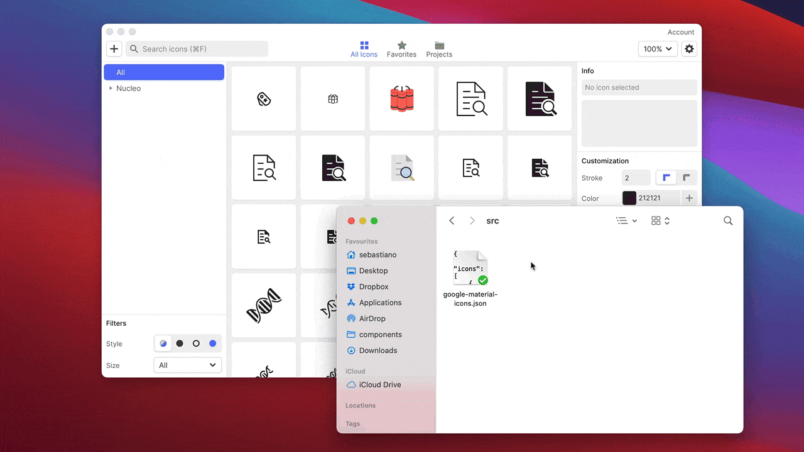

# Google Material Icons (.json)

All the Google Material Design Icons in an easy-to-use .json file.

Material design icons is the official [icon set](https://material.io/design/iconography/system-icons.html) from Google. The icons are designed under the [material design guidelines](https://material.io/design).

[Official Material Design Icons repository →](https://github.com/google/material-design-icons)

## Import the icons in Nucleo

Import and manage the icons using the [Nucleo app](https://nucleoapp.com/).

